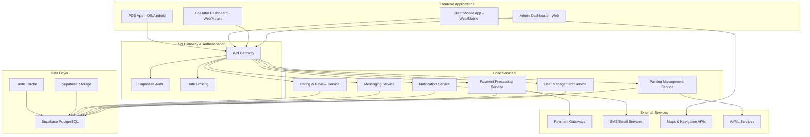
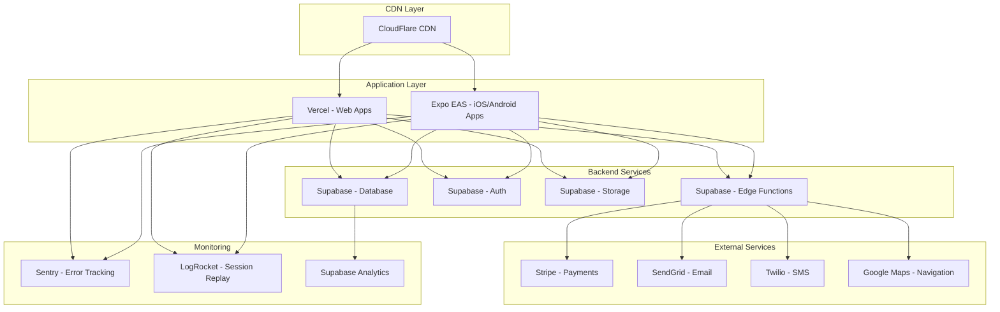

# Park Angel - Comprehensive Parking Management System Design

## Overview

Park Angel is a comprehensive parking management ecosystem consisting of four interconnected applications built on a modern, scalable architecture. The system supports three distinct parking types (Hosted, Street, and Facility) with sophisticated revenue sharing, user management, and real-time operations capabilities. The POS application supports both iOS and Android platforms for maximum operator flexibility.

### System Architecture

The Park Angel system follows a microservices architecture with clean architecture principles, utilizing Supabase as the primary backend service and React/React Native with Expo for the frontend applications.



## Architecture

### Clean Architecture Implementation

The system implements Clean Architecture with the following layers:

1. **Presentation Layer**: React/React Native components with Expo framework
2. **Application Layer**: Use cases and application services
3. **Domain Layer**: Business entities and domain services
4. **Infrastructure Layer**: Supabase integration, external APIs, and data persistence

### Dependency Injection

All applications utilize dependency injection containers to manage:
- Service lifecycles
- Database connections
- External API integrations
- Configuration management
- Testing mock implementations

### Technology Stack

- **Frontend Web**: React 18+ with TypeScript, Vite, TailwindCSS
- **Frontend Mobile**: React Native with Expo SDK 49+ (iOS and Android)
- **Backend**: Supabase (PostgreSQL, Auth, Storage, Edge Functions)
- **State Management**: Zustand with React Query for server state
- **Navigation**: React Router (web), React Navigation (mobile)
- **UI Components**: Custom component library with purple theme
- **Maps**: Google Maps API with custom styling
- **Payments**: Stripe, PayPal, local payment gateways
- **Real-time**: Supabase Realtime subscriptions

## Components and Interfaces

### 1. Admin Dashboard (Web Application)

#### Core Components

```typescript
interface AdminDashboardComponents {
  // Authentication
  LoginForm: React.FC<LoginFormProps>
  TwoFactorAuth: React.FC<TwoFactorProps>
  
  // Dashboard
  MetricsDashboard: React.FC<DashboardProps>
  RealtimeMetrics: React.FC<MetricsProps>
  
  // User Management
  UserManagement: React.FC<UserManagementProps>
  GroupManagement: React.FC<GroupManagementProps>
  PermissionMatrix: React.FC<PermissionProps>
  
  // Operator Management
  OperatorManagement: React.FC<OperatorProps>
  RevenueSharing: React.FC<RevenueSharingProps>
  RemittanceManagement: React.FC<RemittanceProps>
  
  // Parking Management
  LocationHierarchy: React.FC<LocationProps>
  ParkingTypeConfig: React.FC<ParkingTypeProps>
  VIPManagement: React.FC<VIPProps>
  
  // Advertisement System
  AdManagement: React.FC<AdManagementProps>
  AdScheduling: React.FC<AdSchedulingProps>
  AdPerformance: React.FC<AdPerformanceProps>
  
  // Third-Party API
  APIManagement: React.FC<APIManagementProps>
  DeveloperPortal: React.FC<DeveloperPortalProps>
  APIAnalytics: React.FC<APIAnalyticsProps>
  
  // Discount & VAT
  DiscountManagement: React.FC<DiscountProps>
  VATConfiguration: React.FC<VATProps>
  
  // Reporting
  ReportGenerator: React.FC<ReportProps>
  AdvancedFilters: React.FC<FilterProps>
  ExportManager: React.FC<ExportProps>
}
```

#### Key Features

- **Real-time Dashboard**: Live metrics with WebSocket connections
- **Advanced User Management**: Role-based access control with group permissions
- **Revenue Management**: Automated remittance with configurable sharing models
- **Advertisement Platform**: Hierarchical ad placement with conflict resolution
- **API Marketplace**: Third-party developer portal with usage analytics
- **Comprehensive Reporting**: Advanced filtering, sorting, and export capabilities

### 2. Operator Dashboard (Web & Mobile)

#### Core Components

```typescript
interface OperatorDashboardComponents {
  // Authentication
  LoginForm: React.FC<LoginFormProps>
  OTPVerification: React.FC<OTPProps>
  
  // Dashboard
  OperatorMetrics: React.FC<OperatorMetricsProps>
  ComparisonCharts: React.FC<ChartProps>
  
  // Parking Management
  LocationManager: React.FC<LocationManagerProps>
  FacilityLayoutDesigner: React.FC<LayoutDesignerProps>
  SpotManagement: React.FC<SpotManagementProps>
  
  // Pricing Management
  HierarchicalPricing: React.FC<PricingProps>
  DynamicPricingEngine: React.FC<DynamicPricingProps>
  DiscountConfiguration: React.FC<DiscountConfigProps>
  
  // User Management
  CustomerSupport: React.FC<SupportProps>
  VIPManagement: React.FC<VIPManagementProps>
  UserGroupManagement: React.FC<UserGroupProps>
  
  // Reporting
  OperatorReports: React.FC<OperatorReportProps>
  PerformanceAnalytics: React.FC<AnalyticsProps>
}
```

#### Facility Layout Designer

```typescript
interface FacilityLayoutDesigner {
  // Drawing Tools
  drawingCanvas: CanvasElement
  elementPalette: LayoutElement[]
  
  // Layout Elements
  parkingSpots: ParkingSpot[]
  entrances: Entrance[]
  exits: Exit[]
  lanes: Lane[]
  elevators: Elevator[]
  stairs: Stair[]
  
  // Interactions
  dragAndDrop: DragDropHandler
  resize: ResizeHandler
  rotate: RotateHandler
  
  // Export/Import
  saveLayout: () => LayoutData
  loadLayout: (data: LayoutData) => void
  exportImage: () => ImageBlob
}
```

### 3. Client Mobile App (Web & Mobile)

#### Core Components

```typescript
interface ClientAppComponents {
  // Authentication
  SocialLogin: React.FC<SocialLoginProps>
  EmailLogin: React.FC<EmailLoginProps>
  Registration: React.FC<RegistrationProps>
  
  // Parking Discovery
  MapView: React.FC<MapViewProps>
  ParkingSearch: React.FC<SearchProps>
  FilterPanel: React.FC<FilterProps>
  
  // Booking System
  SpotSelection: React.FC<SpotSelectionProps>
  FacilityLayoutViewer: React.FC<LayoutViewerProps>
  BookingFlow: React.FC<BookingFlowProps>
  PaymentProcessor: React.FC<PaymentProps>
  
  // Navigation
  TurnByTurnNavigation: React.FC<NavigationProps>
  FacilityNavigation: React.FC<FacilityNavProps>
  
  // Host Features
  HostOnboarding: React.FC<HostOnboardingProps>
  ListingManagement: React.FC<ListingProps>
  HostDashboard: React.FC<HostDashboardProps>
  
  // Social Features
  MessagingSystem: React.FC<MessagingProps>
  RatingSystem: React.FC<RatingProps>
  ReviewManagement: React.FC<ReviewProps>
  
  // User Management
  ProfileManagement: React.FC<ProfileProps>
  VehicleManagement: React.FC<VehicleProps>
  DiscountApplication: React.FC<DiscountApplicationProps>
}
```

#### Interactive Map Interface

```typescript
interface InteractiveMap {
  // Map Configuration
  mapProvider: 'google' | 'mapbox'
  customStyling: MapStyle
  purpleTheme: ThemeConfig
  
  // Parking Visualization
  parkingSpots: ParkingSpotMarker[]
  occupancyStatus: OccupancyIndicator[]
  pricingDisplay: PriceIndicator[]
  
  // User Interactions
  spotSelection: (spot: ParkingSpot) => void
  filterToggle: (filter: FilterType) => void
  searchLocation: (query: string) => void
  
  // Real-time Updates
  occupancyUpdates: RealtimeSubscription
  priceUpdates: RealtimeSubscription
}
```

### 4. POS App (iOS and Android)

#### Core Components

```typescript
interface POSAppComponents {
  // Cash Management
  CashDrawerManager: React.FC<CashDrawerProps>
  ShiftManagement: React.FC<ShiftProps>
  CashReconciliation: React.FC<ReconciliationProps>
  
  // Transaction Processing
  ParkingSessionCreator: React.FC<SessionCreatorProps>
  PaymentProcessor: React.FC<POSPaymentProps>
  ReceiptPrinter: React.FC<ReceiptProps>
  
  // Monitoring
  OccupancyViewer: React.FC<OccupancyViewerProps>
  ViolationReporting: React.FC<ViolationProps>
  AILicensePlateScanner: React.FC<LicensePlateProps>
  
  // Discount Management
  DiscountSelector: React.FC<DiscountSelectorProps>
  VATCalculator: React.FC<VATCalculatorProps>
  
  // Offline Capabilities
  OfflineStorage: React.FC<OfflineStorageProps>
  SyncManager: React.FC<SyncProps>
}
```

## Data Models

### Core Entities

```typescript
// User Management
interface User {
  id: string
  email: string
  profile: UserProfile
  authProvider: 'email' | 'google' | 'facebook'
  userType: 'client' | 'host' | 'operator' | 'admin' | 'pos'
  status: 'active' | 'inactive' | 'suspended'
  discountEligibility: DiscountType[]
  createdAt: Date
  updatedAt: Date
}

interface UserGroup {
  id: string
  name: string
  description: string
  permissions: Permission[]
  operatorId?: string
  createdAt: Date
}

interface Permission {
  resource: string
  actions: ('create' | 'read' | 'update' | 'delete')[]
  conditions?: PermissionCondition[]
}

// Parking Hierarchy
interface Location {
  id: string
  name: string
  type: 'hosted' | 'street' | 'facility'
  operatorId: string
  address: Address
  coordinates: Coordinates
  sections: Section[]
  pricing: PricingConfig
  settings: LocationSettings
}

interface Section {
  id: string
  locationId: string
  name: string
  zones: Zone[]
  pricing?: PricingConfig
}

interface Zone {
  id: string
  sectionId: string
  name: string
  spots: ParkingSpot[]
  pricing?: PricingConfig
}

interface ParkingSpot {
  id: string
  zoneId: string
  number: string
  type: VehicleType
  status: 'available' | 'occupied' | 'reserved' | 'maintenance'
  coordinates: Coordinates
  pricing?: PricingConfig
  amenities: string[]
}

// Facility Layout
interface FacilityLayout {
  id: string
  locationId: string
  floors: Floor[]
  elements: LayoutElement[]
  metadata: LayoutMetadata
}

interface LayoutElement {
  id: string
  type: 'spot' | 'entrance' | 'exit' | 'lane' | 'elevator' | 'stairs'
  position: Position
  dimensions: Dimensions
  properties: ElementProperties
}

// Pricing System
interface PricingConfig {
  id: string
  baseRate: number
  vehicleTypeRates: VehicleTypeRate[]
  timeBasedRates: TimeBasedRate[]
  holidayRates: HolidayRate[]
  occupancyMultiplier: number
  vatRate: number
  discounts: DiscountRule[]
}

interface DiscountRule {
  id: string
  name: string
  type: 'senior' | 'pwd' | 'custom'
  percentage: number
  isVATExempt: boolean
  conditions: DiscountCondition[]
}

// Booking System
interface Booking {
  id: string
  userId: string
  spotId: string
  vehicleId: string
  startTime: Date
  endTime: Date
  status: 'pending' | 'confirmed' | 'active' | 'completed' | 'cancelled'
  paymentStatus: 'pending' | 'paid' | 'refunded'
  amount: number
  discounts: AppliedDiscount[]
  vatAmount: number
  totalAmount: number
}

// Hosted Parking
interface HostedListing {
  id: string
  hostId: string
  title: string
  description: string
  photos: string[]
  amenities: string[]
  accessInstructions: string
  pricing: HostPricing
  availability: AvailabilitySchedule
  reviews: Review[]
  rating: number
}

interface HostPayout {
  id: string
  hostId: string
  bookingIds: string[]
  grossAmount: number
  platformFee: number
  netAmount: number
  status: 'pending' | 'processed' | 'failed'
  processedAt?: Date
}

// Messaging System
interface Message {
  id: string
  conversationId: string
  senderId: string
  receiverId: string
  content: string
  type: 'text' | 'image' | 'file'
  isEncrypted: boolean
  readAt?: Date
  createdAt: Date
}

interface Conversation {
  id: string
  participants: string[]
  type: 'user_host' | 'user_operator' | 'user_support'
  lastMessage: Message
  isActive: boolean
}

// Rating System
interface Rating {
  id: string
  bookingId: string
  raterId: string
  ratedId: string
  ratedType: 'spot' | 'host' | 'operator' | 'user'
  score: number
  review?: string
  photos?: string[]
  createdAt: Date
}

// Advertisement System
interface Advertisement {
  id: string
  title: string
  content: AdContent
  targetLocation: string
  targetType: 'section' | 'zone'
  schedule: AdSchedule
  budget: number
  status: 'pending' | 'approved' | 'active' | 'paused' | 'completed'
  metrics: AdMetrics
}

// Performance Monitoring
interface PerformanceMetric {
  id: string
  feature: string
  responseTime: number
  timestamp: Date
  userId?: string
  metadata: Record<string, any>
}

interface SLATarget {
  feature: string
  targetResponseTime: number
  alertThreshold: number
  escalationRules: EscalationRule[]
}
```

## Error Handling

### Error Classification

```typescript
enum ErrorType {
  VALIDATION = 'validation',
  AUTHENTICATION = 'authentication',
  AUTHORIZATION = 'authorization',
  NOT_FOUND = 'not_found',
  CONFLICT = 'conflict',
  RATE_LIMIT = 'rate_limit',
  PAYMENT = 'payment',
  EXTERNAL_SERVICE = 'external_service',
  SYSTEM = 'system'
}

interface AppError {
  type: ErrorType
  code: string
  message: string
  details?: Record<string, any>
  timestamp: Date
  userId?: string
  requestId: string
}
```

### Error Handling Strategy

1. **Client-Side Error Boundaries**: React Error Boundaries for graceful UI error handling
2. **Global Error Handler**: Centralized error processing and logging
3. **User-Friendly Messages**: Contextual error messages with recovery suggestions
4. **Retry Mechanisms**: Automatic retry for transient failures
5. **Offline Support**: Graceful degradation when network is unavailable

## Testing Strategy

### Testing Pyramid

```typescript
interface TestingStrategy {
  // Unit Tests (70%)
  unitTests: {
    framework: 'Jest' | 'Vitest'
    coverage: 90
    focus: ['business logic', 'utilities', 'components']
  }
  
  // Integration Tests (20%)
  integrationTests: {
    framework: 'Jest' | 'Cypress'
    focus: ['API endpoints', 'database operations', 'external services']
  }
  
  // End-to-End Tests (10%)
  e2eTests: {
    framework: 'Playwright' | 'Detox'
    focus: ['critical user journeys', 'payment flows', 'booking processes']
  }
  
  // Performance Tests
  performanceTests: {
    framework: 'k6' | 'Artillery'
    focus: ['API response times', 'database queries', 'concurrent users']
  }
}
```

### Test Data Management

- **Test Database**: Separate Supabase project for testing
- **Mock Services**: Mock external APIs and payment gateways
- **Seed Data**: Consistent test data across environments
- **Cleanup**: Automated test data cleanup after test runs

## Security Considerations

### Authentication & Authorization

```typescript
interface SecurityConfig {
  authentication: {
    provider: 'supabase'
    methods: ['email', 'oauth']
    mfa: boolean
    sessionTimeout: number
  }
  
  authorization: {
    model: 'RBAC'
    permissions: 'resource-based'
    inheritance: 'hierarchical'
  }
  
  dataProtection: {
    encryption: 'AES-256'
    piiHandling: 'encrypted'
    dataRetention: 'configurable'
  }
  
  apiSecurity: {
    rateLimit: 'redis-based'
    cors: 'strict'
    validation: 'joi-schemas'
  }
}
```

### Data Privacy

- **GDPR Compliance**: Right to be forgotten, data portability
- **PII Encryption**: All personally identifiable information encrypted at rest
- **Audit Logging**: Comprehensive audit trails for all data access
- **Data Minimization**: Collect only necessary data

### Payment Security

- **PCI DSS Compliance**: No card data stored locally
- **Tokenization**: Payment tokens for recurring transactions
- **Fraud Detection**: Real-time fraud monitoring
- **Secure Communication**: TLS 1.3 for all payment communications

## Performance Optimization

### Frontend Performance

```typescript
interface PerformanceOptimizations {
  // Code Splitting
  codeSplitting: {
    routeBased: boolean
    componentBased: boolean
    lazyLoading: boolean
  }
  
  // Caching
  caching: {
    serviceWorker: boolean
    apiCache: 'react-query'
    staticAssets: 'cdn'
  }
  
  // Bundle Optimization
  bundleOptimization: {
    treeshaking: boolean
    minification: boolean
    compression: 'gzip'
  }
  
  // Image Optimization
  imageOptimization: {
    formats: ['webp', 'avif']
    lazyLoading: boolean
    responsiveImages: boolean
  }
}
```

### Backend Performance

- **Database Optimization**: Proper indexing, query optimization
- **Caching Strategy**: Redis for session data and frequently accessed data
- **CDN Integration**: Static asset delivery via CDN
- **Connection Pooling**: Efficient database connection management

### Mobile Performance

- **Bundle Size**: Optimized bundle size for mobile networks (iOS and Android)
- **Offline Support**: Critical features work offline on both platforms
- **Battery Optimization**: Efficient background processing with platform-specific optimizations
- **Memory Management**: Proper cleanup of resources with iOS and Android best practices
- **Platform Integration**: Native iOS features (Touch ID, Face ID) and Android hardware integration

## Accessibility Implementation

### WCAG 2.1 AA Compliance

```typescript
interface AccessibilityFeatures {
  // Visual
  visual: {
    colorContrast: 'AA-compliant'
    fontSize: 'scalable'
    focusIndicators: 'visible'
    colorBlindness: 'supported'
  }
  
  // Motor
  motor: {
    keyboardNavigation: 'full'
    touchTargets: '44px-minimum'
    gestureAlternatives: 'provided'
  }
  
  // Cognitive
  cognitive: {
    clearLanguage: 'simple'
    errorPrevention: 'validation'
    timeouts: 'adjustable'
  }
  
  // Auditory
  auditory: {
    captions: 'provided'
    transcripts: 'available'
    audioAlternatives: 'text'
  }
}
```

### ARIA Implementation

- **Semantic HTML**: Proper use of semantic elements
- **ARIA Labels**: Descriptive labels for interactive elements
- **Live Regions**: Dynamic content announcements
- **Focus Management**: Logical focus order and management

## Deployment Architecture

### Infrastructure



### Environment Strategy

- **Development**: Local development with Supabase local setup
- **Staging**: Full feature testing environment
- **Production**: High-availability production environment
- **Testing**: Automated testing environment

### CI/CD Pipeline

```yaml
# GitHub Actions Workflow
name: Park Angel CI/CD
on:
  push:
    branches: [main, develop]
  pull_request:
    branches: [main]

jobs:
  test:
    runs-on: ubuntu-latest
    steps:
      - uses: actions/checkout@v3
      - name: Setup Node.js
        uses: actions/setup-node@v3
        with:
          node-version: '18'
      - name: Install dependencies
        run: npm ci
      - name: Run tests
        run: npm run test:ci
      - name: Run E2E tests
        run: npm run test:e2e
  
  deploy:
    needs: test
    runs-on: ubuntu-latest
    if: github.ref == 'refs/heads/main'
    steps:
      - name: Deploy to Vercel
        uses: amondnet/vercel-action@v20
      - name: Deploy to EAS
        uses: expo/expo-github-action@v7
```

This comprehensive design document provides the foundation for implementing the Park Angel parking management system with all the requested features, modern architecture, and best practices for scalability, security, and user experience.